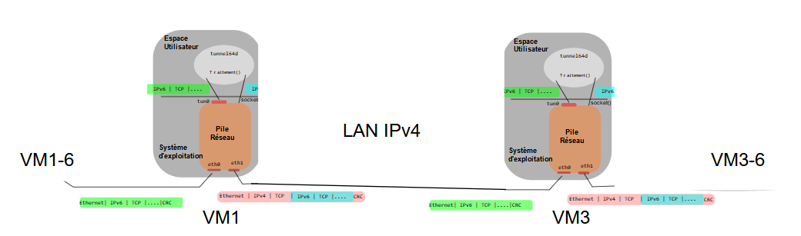

Maxime SCHLEGEL

# Projet Réseaux 2020

## 1. Configuration Réseau

### 1.1. Topologie et Adressage

J'ai choisit d'utiliser un adressage fixe pour ce projet. On a donc les adresses suivantes sur les VMs.
|        | LAN1            | LAN2            | LAN3-6           | LAN4-6           | LAN1-6           | LAN2-6           |
| ------ | --------------- | --------------- | ---------------- | ---------------- | ---------------- | ---------------- |
| réseau | 172.16.2.128/28 | 172.16.2.160/28 | fc00:1234 :3::/64 | fc00:1234 :4::/64 | fc00:1234 :1::/64 | fc00:1234 :2::/64 |
| VM1    | 172.16.2.131    |                 | fc00:1234 :3::1   |                  |                  |                  |
| VM2    | 172.16.2.132    | 172.16.2.162    |                  |                  |                  |                  |
| VM3    |                 | 172.16.2.163    |                  | fc00:1234 :4::3   |                  |                  |
| VM1-6  |                 |                 | fc00:1234 :3::16  |                  | fc00:1234 :1::16  |                  |
| VM2-6  |                 |                 |                  |                  | fc00:1234 :1::26  | fc00:1234 :2::26  |
| VM3-6  |                 |                 |                  | fc00:1234 :4::36  |                  | fc00:1234 :2::36  |


Bien que la configuration salt rencontre des problème lors de l'installation des package (n'arrive pas à trouver les repo), une fois qu'elles ont reussit on arrive bien à 
Une fois la configuration avec salt terminé on peut bien accéder aux serveurs echo de la VM3 et VM3-6.


## 2. L'interface virtuelle TUN

### 2.2. Configuration de l'interface

Pour configurer l'interface tun0, j'ai choisit d'utiliser un masque en /64. Et j'ai aussi activé le "packet forwarding" sur la VM pour lui permettre de retransmettre les packets provenant de extérieurs sur cette interface.

Il faudra modifier la route pour accéder au LAN4-6: passer la paserelle de VM2-6 à l'interface eth2 de la VM1. 

```
> ping6 fc00:1234:ffff::1

No.     Time           Source                Destination           Protocol Length Info
      1 0.000000000    fc00:1234:ffff::1     fc00:1234:ffff::1     ICMPv6   120    Echo (ping) request id=0x074f, seq=1, hop limit=64 (reply in 2)

Frame 1: 120 bytes on wire (960 bits), 120 bytes captured (960 bits) on interface 0
Linux cooked capture
Internet Protocol Version 6, Src: fc00:1234:ffff::1 (fc00:1234:ffff::1), Dst: fc00:1234:ffff::1 (fc00:1234:ffff::1)
Internet Control Message Protocol v6

No.     Time           Source                Destination           Protocol Length Info
      2 0.000007000    fc00:1234:ffff::1     fc00:1234:ffff::1     ICMPv6   120    Echo (ping) reply id=0x074f, seq=1, hop limit=64 (request in 1)

Frame 2: 120 bytes on wire (960 bits), 120 bytes captured (960 bits) on interface 0
Linux cooked capture
Internet Protocol Version 6, Src: fc00:1234:ffff::1 (fc00:1234:ffff::1), Dst: fc00:1234:ffff::1 (fc00:1234:ffff::1)
Internet Control Message Protocol v6
```

```
>ping6 fc00:1234:ffff::10
No.     Time           Source                Destination           Protocol Length Info
      1 0.000000000    fc00:1234:ffff::1     fc00:1234:ffff::10    ICMPv6   120    Echo (ping) request id=0x0775, seq=1, hop limit=64 (no response found!)

Frame 1: 120 bytes on wire (960 bits), 120 bytes captured (960 bits) on interface 0
Linux cooked capture
Internet Protocol Version 6, Src: fc00:1234:ffff::1 (fc00:1234:ffff::1), Dst: fc00:1234:ffff::10 (fc00:1234:ffff::10)
Internet Control Message Protocol v6
```

Lorsque l'on ping l'ip ```fc00:1234:ffff::1```, on obtient bien une réponse ce qui n'est pas le cas pour l'interface ```fc00:1234:ffff::10```.
Ce comportemant correspond à celui attendu: l'interface même virtuelle reste une interface systeme elle répond donc normalemet aux pings. Comme il n'y a pas d'interface derrière l'ip ```fc00:1234:ffff::10``` nous n'avons pas deréponse.

### 2.3. Récupération des paquets

Lorsque l'on ping ```fc00:1234:ffff::1``` on obtient une réponse par contre on ne le voit pas sur la sortie standard.

Inversement  losque l'on ping ```fc00:1234:ffff::10```, on obtient aucune réponse mais on peut l'observer sur la sortie standard.
Avec hexdump:
```
00000090  00 00 00 00 00 00 00 02  60 00 00 00 00 40 3a 40  |........`....@:@|
000000a0  fc 00 12 34 ff ff 00 00  00 00 00 00 00 00 00 01  |...4............|
000000b0  fc 00 12 34 ff ff 00 00  00 00 00 00 00 00 00 10  |...4............|
000000c0  80 00 40 a2 28 54 00 01  af 3b d0 5f 00 00 00 00  |..@.(T...;._....|
000000d0  bb a4 00 00 00 00 00 00  10 11 12 13 14 15 16 17  |................|
000000e0  18 19 1a 1b 1c 1d 1e 1f  20 21 22 23 24 25 26 27  |........ !"#$%&'|
000000f0  28 29 2a 2b 2c 2d 2e 2f  30 31 32 33 34 35 36 37  |()*+,-./01234567|
```

On observe ce comportement pour la seconde ip car l'interface virtuelle écrit les données dans le fichier de tun0 pour que le système puisse le lire.

Avec wireshark:
```
00000000  00 04 ff fe 00 00 00 00  00 00 00 00 00 00 86 dd  |................|
00000010  60 00 00 00 00 40 3a 40  fc 00 12 34 ff ff 00 00  |`....@:@...4....|
00000020  00 00 00 00 00 00 00 01  fc 00 12 34 ff ff 00 00  |...........4....|
00000030  00 00 00 00 00 00 00 10  80 00 40 a2 28 54 00 01  |..........@.(T..|
00000040  af 3b d0 5f 00 00 00 00  bb a4 00 00 00 00 00 00  |.;._............|
00000050  10 11 12 13 14 15 16 17  18 19 1a 1b 1c 1d 1e 1f  |................|
00000060  20 21 22 23 24 25 26 27  28 29 2a 2b 2c 2d 2e 2f  | !"#$%&'()*+,-./|
00000070  30 31 32 33 34 35 36 37                           |01234567|
00000078
```
On peut observer un décalage des bits du paket entre wireshark et hexdump.


>IFF_NO_The PI tells the kernel that it does not need to provide message    information, that is, it only needs to provide "pure" IP messages and no other bytes.Otherwise (do not set IFF_NO_PI), which adds four extra bytes >>(2-byte identity and 2-byte protocol) at the beginning of the message.
L'option IFF_NO_PI permet donc d'omettre certain bits du message retransmis.

## 3. Un tunnel simple pour IPv6

### 3.1. Redirection du trafic entrant

Une fois les deux extremités connectées on observe le traffic entrant sur l'ext-in sur la sortie standard de l'ext-out.

### 3.2. Redirection du trafic sortant

Si le traffic injecté à une extrmité du tunnel devait resortir sur l'extrémité "out" puis continuer sont parcours vers la machine visée.
En effet si la VM servant de sortie au tunnel connais la route vers se destination elle devrait le transmettre.
En effet le file descriptor tun0 fait office d'interface entre notre code et la VM (ce qui est ecrit dedans est retransmis et ce qui arrive est écrit dedans)

Pour tester que la connectivité fonctionne bien, je propose d'utiliser le protocole suivant:
    - capturer un packet icmp6 de l'extremité out vers une des VM de son"coté"
    - l'injecter dans l'extrmité in
    - observer avec wireshark si le packet est bien retransmis
Si tout ce passe bien on devrait voir le packet ping être redirigé de l'extremité out (interface tun0) vers sa cible.
Et nous devrions la voir chercher à renvoyer une réponse.


### 3.4. Mise en place du tunnel entre VM1 et VM3 : Schémas



Le tunel sera installé sur les VM1 et VM3 pour permettre la communication entre les LAN3-6 et LAN4-6.
Un provenant de la VM1-6 sera d'abord routé vers la VM1 sur son interface "eth2" puis grâce à l'IP forwarding sur l'ip ```fc00:1234 :ffff::10```. Cela permettra aux serveur tunnel64d de lire le traffic entrant et de l'encapsulé dans des packets IPv4 pour VM3.
Sur VM3 l'inverse se produit: les packets IPv4 sont descontruits et l'extremité out pousse le payload (donc le packet IPv6) sur son tun0. La stack réseaux s'occupe ensuite de rediriger le packet où il le faut.

Le parcours de VM3 à VM1 est parfaitement symétrique à celui de VM1 à VM3.

### 3.5. Mise en place du tunnel entre VM1 et VM3 : Système

En lançant ```tunnel64d``` sur la VM1 et VM3 on arive bien à échanger des messages (icmp, tcp) entre les LAN au par avant déconnectés.

## 4. Validation Fonctionnelle

### 4.1. Configuration

- VM1-6:
    ```
    > ip -6 addr
    3: eth1: <BROADCAST,MULTICAST,UP,LOWER_UP> mtu 1500 qlen 1000
        inet6 fc00:1234:1::16/64 scope global 
        valid_lft forever preferred_lft forever
    4: eth2: <BROADCAST,MULTICAST,UP,LOWER_UP> mtu 1500 qlen 1000
        inet6 fc00:1234:3::16/64 scope global 
        valid_lft forever preferred_lft forever

    > ip -6 route
    fc00:1234:1::/64 dev eth1  proto kernel  metric 256 
    fc00:1234:2::/64 via fc00:1234:1::26 dev eth1  metric 1024 
    fc00:1234:3::/64 dev eth2  proto kernel  metric 256 
    fc00:1234:4::/64 via fc00:1234:3::1 dev eth2  metric 1024 
    fe80::/64 dev eth0  proto kernel  metric 256 
    fe80::/64 dev eth1  proto kernel  metric 256 
    fe80::/64 dev eth2  proto kernel  metric 256
    ```

- VM1:
    ```
    > ip -6 addr
    3: eth1: <BROADCAST,MULTICAST,UP,LOWER_UP> mtu 1500 qlen 1000
        inet6 fe80::a00:27ff:fe87:33bb/64 scope link 
            valid_lft forever preferred_lft forever
    4: eth2: <BROADCAST,MULTICAST,UP,LOWER_UP> mtu 1500 qlen 1000
        inet6 fc00:1234:3::1/64 scope global 
            valid_lft forever preferred_lft forever
    11: tun0: <POINTOPOINT,MULTICAST,NOARP,UP,LOWER_UP> mtu 1500 qlen 500
        inet6 fc00:1234:ffff::1/64 scope global 
            valid_lft forever preferred_lft forever

    > ip -6 route
    fc00:1234:1::/64 dev eth1  proto kernel  metric 256 
    fc00:1234:2::/64 via fc00:1234:1::26 dev eth1  metric 1024 
    fc00:1234:3::/64 dev eth2  proto kernel  metric 256 
    fc00:1234:4::/64 via fc00:1234:3::1 dev eth2  metric 1024 
    fe80::/64 dev eth0  proto kernel  metric 256 
    fe80::/64 dev eth1  proto kernel  metric 256 
    fe80::/64 dev eth2  proto kernel  metric 256
    ```

- VM2: 
    ```
    > ip addr
    3: eth1: <BROADCAST,MULTICAST,UP,LOWER_UP> mtu 1500 qdisc pfifo_fast state UP group default qlen 1000 
        inet 172.16.2.132/28 brd 172.16.2.143 scope global eth1 
            valid_lft forever preferred_lft forever
    4: eth2: <BROADCAST,MULTICAST,UP,LOWER_UP> mtu 1500 qdisc pfifo_fast state UP group default qlen 1000 
        inet 172.16.2.162/28 brd 172.16.2.175 scope global eth2 
            valid_lft forever preferred_lft forever

    > ip route
    10.0.2.0/24 dev eth0  proto kernel  scope link  src 10.0.2.15 
    172.16.2.128/28 dev eth1  proto kernel  scope link  src 172.16.2.132 
    172.16.2.160/28 dev eth2  proto kernel  scope link  src 172.16.2.162
    ```

- VM3:
    ```
    > ip -6 addr
    3: eth1: <BROADCAST,MULTICAST,UP,LOWER_UP> mtu 1500 qdisc pfifo_fast state UP group default qlen 1000
        inet 172.16.2.163/28 brd 172.16.2.175 scope global eth1
            valid_lft forever preferred_lft forever
    4: eth2: <BROADCAST,MULTICAST,UP,LOWER_UP> mtu 1500 qdisc pfifo_fast state UP group default qlen 1000
        inet6 fc00:1234:4::3/64 scope global 
            valid_lft forever preferred_lft forever
    9: tun0: <POINTOPOINT,MULTICAST,NOARP,UP,LOWER_UP> mtu 1500 qdisc pfifo_fast state UNKNOWN group default qlen 500
        inet6 fc00:1234:ffff::1/64 scope global 
            valid_lft forever preferred_lft forever

    > ip -6 route
    fc00:1234:1::/64 via fc00:1234:4::36 dev eth2  metric 1024 
    fc00:1234:2::/64 via fc00:1234:4::36 dev eth2  metric 1024 
    fc00:1234:3::/64 via fc00:1234:ffff::10 dev tun0  metric 1024 
    fc00:1234:4::/64 dev eth2  proto kernel  metric 256 
    fc00:1234:ffff::/64 dev tun0  proto kernel  metric 256 
    fe80::/64 dev eth0  proto kernel  metric 256 
    fe80::/64 dev eth1  proto kernel  metric 256 
    fe80::/64 dev eth2  proto kernel  metric 256
    ```

- VM3-6:
    ```
    > ip -6 addr
    3: eth1: <BROADCAST,MULTICAST,UP,LOWER_UP> mtu 1500 qlen 1000
        inet6 fc00:1234:2::36/64 scope global 
            valid_lft forever preferred_lft forever
    4: eth2: <BROADCAST,MULTICAST,UP,LOWER_UP> mtu 1500 qlen 1000
        inet6 fc00:1234:4::36/64 scope global 
            valid_lft forever preferred_lft forever
    
    > ip -6 route
    fc00:1234:1::/64 via fc00:1234:2::26 dev eth1  metric 1024 
    fc00:1234:2::/64 dev eth1  proto kernel  metric 256 
    fc00:1234:3::/64 via fc00:1234:4::3 dev eth2  metric 1024 
    fc00:1234:4::/64 dev eth2  proto kernel  metric 256 
    fe80::/64 dev eth0  proto kernel  metric 256 
    fe80::/64 dev eth1  proto kernel  metric 256 
    fe80::/64 dev eth2  proto kernel  metric 256
    ```

J'ai choisit d'omettre les liens locaux ainsi que les interfaces qui ne sont pas utlisés dans ce projet pour avoir des configurations plus courtes.
Les routes sont cohérentes avec le fonctionement du tunnel: l'entré la plus proche (ici la seule) remplace la VM2-6 dans les routes.

### 4.2. Couche 3

Les pings entre les VM1-6 et VM3-6 sont bien retransmis par le tunnel dans les deux sens.

```
No.     Time           Source                Destination           Protocol Length Info
      1 0.000000000    fc00:1234:3::16       fc00:1234:4::36       ICMPv6   120    Echo (ping) request id=0x08c1, seq=1, hop limit=64 (reply in 2)

Frame 1: 120 bytes on wire (960 bits), 120 bytes captured (960 bits) on interface 0
Linux cooked capture
Internet Protocol Version 6, Src: fc00:1234:3::16 (fc00:1234:3::16), Dst: fc00:1234:4::36 (fc00:1234:4::36)
Internet Control Message Protocol v6

No.     Time           Source                Destination           Protocol Length Info
      2 0.003780000    fc00:1234:4::36       fc00:1234:3::16       ICMPv6   120    Echo (ping) reply id=0x08c1, seq=1, hop limit=62 (request in 1)

Frame 2: 120 bytes on wire (960 bits), 120 bytes captured (960 bits) on interface 0
Linux cooked capture
Internet Protocol Version 6, Src: fc00:1234:4::36 (fc00:1234:4::36), Dst: fc00:1234:3::16 (fc00:1234:3::16)
Internet Control Message Protocol v6
```

### 4.3. Couche 4

Comme pour les ping le serveurs echo est maintenant fonctionnel:
```
root@vm1-6:/mnt/partage/tunnel# cat HelloWorld.txt 
Hello echo server !

root@vm1-6:/mnt/partage/tunnel# nc6 fc00:1234:4::36 echo < HelloWorld.txt 
Hello echo server !

^C
```

### 4.4. Couche 4 : bande passante

Voici les résultat du benchmarch de la bande passante en fonction de la taille du tampon.

|  taille   |  Bandwidth      |
| --------- | --------------- |
| petit     | 2.16 Mbits/sec  |
| moyen     | 42.8 Mbits/sec  |
| gros      | 127 Mbits/sec   |
| très gros | 98.5 Mbits/sec  |

## 5. Améliorations

### 5.6. Annonce de route IPv6

J'ai essayé de mettre en place la publicité automatique avec Radvd pour les deux extrémité.
J'ai bien réussit à mettre en place les services et leur configuration:
- la VM1 publie la route vers ```fc00:1234:4::/64```
- la VM3 publie la route vers ```fc00:1234:3::/64```

Mais les VM1-6 et VM3-6 ne semble pas les prendre ne compte.